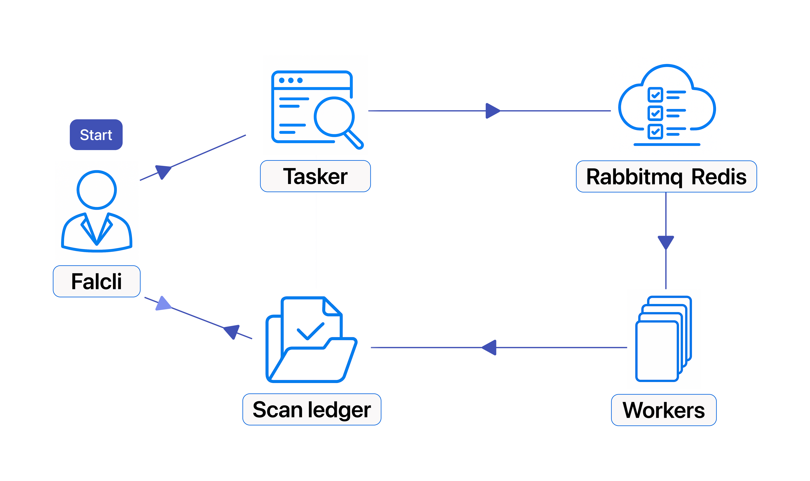

# Architecture Overview

**Falcoria** is a modular scanning system built for automation and scale. It coordinates multiple machines to scan large environments faster — while keeping results accurate, organized, and easy to access.

---

## Core Components

- **CLI (`falcli`)**  
  Command-line interface for launching scans, importing data, and retrieving results via API.

- **Tasker (API)**  
  Orchestrates scan requests. It validates input, deduplicates targets, associates scans with projects, and queues tasks for execution.

- **Worker**  
  Executes scan tasks using Nmap. Designed for parallel execution and horizontal scaling.

- **ScanLedger (API)**  
  Backend API for storing and retrieving scan results. Also supports importing external scan data and accessing metadata.

- **Redis**  
  Tracks scan state during execution and enforces deduplication during task creation.

- **RabbitMQ**  
  Message broker that distributes scan tasks from Tasker to Worker nodes.

---

## System Diagram

---

## Scan Workflow

1. The user runs `falcli` with a list of targets and optional scan configuration.
2. `falcli` sends the request to Tasker via API.
3. Tasker validates the request, links it to a project, applies deduplication, and prepares scan tasks.
4. Tasks are pushed to RabbitMQ.
5. Workers receive tasks and execute scans using Nmap.
6. Scan results are sent to ScanLedger.
7. Results can be retrieved via `falcli`.

---

## Scalability

- Workers can be added or removed dynamically.
- Each Worker supports parallel execution.
- The architecture has no fixed upper limit on Worker count.

---

## Extensibility

Falcoria is built for modularity and scan chaining. Planned or supported extensions include:

- Tool chaining (e.g., Nmap → Nuclei)
- Conditional workflows and multi-stage task logic
- Reusable scan templates with structured logic
