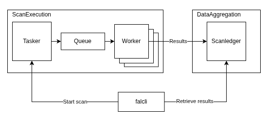

# Architecture

Falcoria has two subsystems: **Scan Execution** and **Data Aggregation**. They communicate through APIs and can run independently.

{ width="700" align=center }

## Data Aggregation

The center of the system is **[ScanLedger](https://github.com/Falcoria/scanledger)** — the shared dataset where all scan results end up. Data is organized by project. Each project maintains its own shared state with unique records per IP, port, and hostname. Scans, imports, exports — everything is scoped to a project. When new scan data comes in, it gets merged into existing records according to [import mode](concepts/import-modes.md) rules.

ScanLedger also tracks [change history](concepts/change-history.md) — if a port state, service, or banner changes between scans, the change is recorded.

ScanLedger can be used on its own, without the scan execution subsystem. If you already run your own scans with Nmap or other tools, you can import reports into ScanLedger directly and use it purely for data aggregation.

## Scan Execution

Handles everything from accepting a scan request to delivering results to ScanLedger. Three components:

**[Tasker](https://github.com/Falcoria/tasker)** accepts scan requests via API or [`falcli`](https://github.com/Falcoria/falcli). It prepares targets before anything gets scanned: expands CIDRs, resolves hostnames, removes duplicates, and checks what's already been scanned or queued. The output is a set of discrete scan tasks, each targeting a single IP address with a defined port range and associated hostnames kept as metadata.

**Queue** holds prepared tasks until workers pick them up. If the same target is already queued, the duplicate is rejected.

**[Workers](https://github.com/Falcoria/worker)** pull tasks from the queue and execute scans. Each worker runs on its own machine with its own network path and IP address. Results go straight to ScanLedger via API. Workers don't talk to each other — the queue handles assignment, ScanLedger handles merging.

Adding workers scales throughput linearly. Ten workers finish roughly ten times faster than one, until target-side rate limits or network saturation become the bottleneck.

## Data flow

1. User submits targets and a scan config to **Tasker** (via `falcli` or API)
2. Tasker deduplicates targets and creates scan tasks
3. Tasks enter the **Queue**
4. **Workers** pick up tasks and execute scans
5. Workers send results to **ScanLedger** via API
6. ScanLedger merges results into the shared state
7. Team queries current data via `falcli`, API, or export (Nmap XML, JSON)

<!-- TODO: image — data flow diagram.
Left: user with "falcli / API" label.
Arrow to "Tasker" (dedup, task creation).
Arrow to "Queue".
Arrow to three "Worker" boxes (cloud-eu, cloud-us, vpn-1), each with its own IP.
All workers → "ScanLedger".
ScanLedger → outputs: API, falcli, Export (XML, JSON).
ScanLedger should be visually prominent — it's the center of the system. -->

## Deployment

Tasker and ScanLedger are FastAPI applications. Each exposes API docs at `/docs` when running.

Workers can be deployed anywhere — cloud VMs, VPSes, VPN endpoints. The only requirement is network access to the queue and to ScanLedger. The number of workers determines how fast the scope gets covered.

For data aggregation only (no scanning), ScanLedger and `falcli` are enough.
