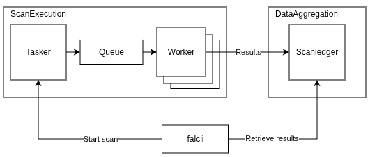

# Architecture

Falcoria is built around two main components:

- **Scan Execution**
- **Data Aggregation**

They are implemented as independent API services and communicate only through well-defined interfaces.  
This separation allows scan execution and data handling to evolve and scale independently.

<!-- Architecture diagram -->

  

---

## Core Components

### Scan Execution

Scan Execution is responsible for running scans.

Its role is to prepare scan tasks, execute them, and deliver raw results for aggregation.

Scan Execution consists of three parts:

- **Tasker**
- **Queue**
- **Workers**

**Tasker** accepts scan requests (via API or `falcli`), performs target preparation, and applies **target deduplication** before execution.  
Duplicate IPs, hostnames, and subnets are removed at this stage.  
→ See: [Deduplication](concepts/deduplication)

Each execution task targets:

- a single IP address,
- a defined set of ports,
- associated hostnames (kept as metadata).

Prepared tasks are published to the **Queue**.

**Queue** stores execution tasks until they are picked up by workers.

**Workers** consume tasks from the queue and execute scans.  
Each worker runs on its own machine or network environment and uses its own network path to the target.

This is critical for **Distribution**:  
workers must have independent network paths for parallel execution to be effective.  
→ See: [Distribution](concepts/distribution)

Scan Execution scales by adding workers.

---

### Data Aggregation

Data Aggregation is responsible for maintaining the shared scan dataset.

It receives scan results from workers and applies them to a single shared state used by the entire team.

Data Aggregation consists of one core component:

- **ScanLedger**

**ScanLedger** stores scan data as a shared dataset with unique records.  
New results update existing entries or extend them, rather than creating duplicates.

All logic related to:

- incremental updates,
- partial updates,
- replacement of scanned data,
- and change tracking

is handled inside ScanLedger.

→ See:
- [Import Modes](concepts/import-modes)
- [History Tracking](concepts/track-history)

ScanLedger is the single source of truth for hosts, IPs, ports, services, and their change history.

---

## Scan Flow

1. A scan request is sent via **falcli** or API.
2. The request reaches **Tasker**.
3. Tasker applies deduplication and prepares execution tasks.
4. Tasks are published to the **Queue**.
5. **Workers** pull tasks and execute scans.
6. Scan results are sent to **ScanLedger**.
7. ScanLedger merges results into the shared dataset.
8. Users retrieve data from ScanLedger via API or `falcli`.

---

## Key Properties

- Scan execution and data aggregation are cleanly separated.
- Execution scales by adding workers with independent network paths.
- All scan data is merged into one shared dataset.
- Partial rescans and incremental updates do not break existing data.
- The entire team always works with the same current view.
