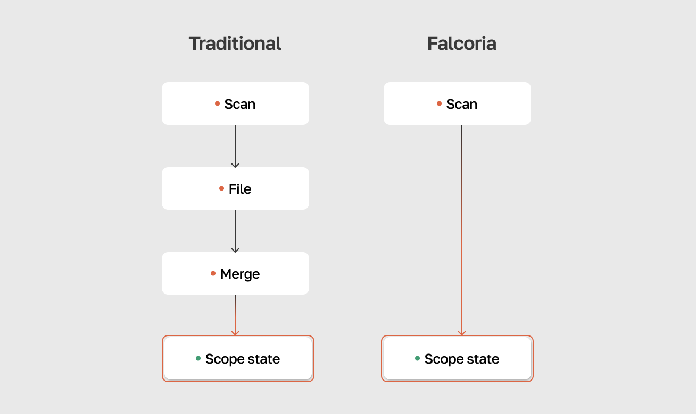

# Falcoria

Falcoria is a system for team-based port scanning on large scopes. It maintains a shared scope state that every scan updates — no separate files to merge.

## The problem

On a large engagement, scan output multiplies fast. Different people use different tools, the scope gets split into chunks, rescans add more files. After a few days, there's no single place to check what's open — the answer is spread across dozens of files from different people and points in time.

Teams deal with this using whatever is at hand — shared folders, spreadsheets, Notion, Slack. None of these are built for scan data, and the results still have to be merged.

{ width="700" align=center }

## How Falcoria approaches this

Falcoria treats scans as state updates. Each scan — whether Falcoria's own or an imported report — writes directly into a shared dataset called [ScanLedger](architecture.md). There is no intermediate file step.

### What this gives you

- **[Shared scope state](concepts/scope-state.md)** — each scan updates a persistent shared dataset. No intermediate files or manual merge steps — every team member sees the same current scope state immediately after a scan completes.

- **[Import modes](concepts/import-modes.md)** — operator controls how each scan is applied — HTTP-only first, then full range, then service detection — each pass adds to the same result without overwriting previous data. The system parses scan commands to know which ports were in scope — ports in range but absent from results are marked as closed.

- **[Change tracking](concepts/change-history.md)** — records state transitions between scans: newly opened ports, closures, service changes. No manual diffing of scan outputs.

- **[Deduplication](concepts/deduplication.md)** — eliminates redundant targets before scanning starts. Different team members can submit overlapping targets — each is scanned only once. Deduplication cuts the scope by [~20% to nearly 50%](concepts/deduplication.md) before a single packet is sent. Fewer duplicate probes, lower network noise, reduced risk of triggering rate limits.

- **[Distributed execution](concepts/distribution.md)** — splits work across multiple workers on separate machines and network paths. Ten workers scan roughly ten times faster than one, without increasing the rate on any single target. See [Benchmarks](benchmarks.md) for measured results.

- **[Resumable scans](workflows.md#resuming-interrupted-scans)** — interrupted scans pick up where they left off. The task queue tracks completed units of work.

- **[Export](workflows.md#exporting-results)** — the current scope state can be generated as Nmap XML or JSON at any time, preserving compatibility with existing tooling.

{ width="700" align=center }

*Scope state evolving across three scans: ports are added, services detected, changes tracked.*

## Who it is for

- Penetration testers managing large scopes with a team
- Red team operators running repeated discovery across changing networks
- Security engineers maintaining current host/port/service visibility
- Security automation teams looking for an API-driven backend to aggregate scan data from various sources

## Next steps

- [Getting Started](getting-started.md) — setup and first scan
- [Architecture](architecture.md) — how the system is structured
- [Concepts](concepts/index.md) — how the pipeline works end to end
- [Workflows](workflows.md) — common usage patterns
