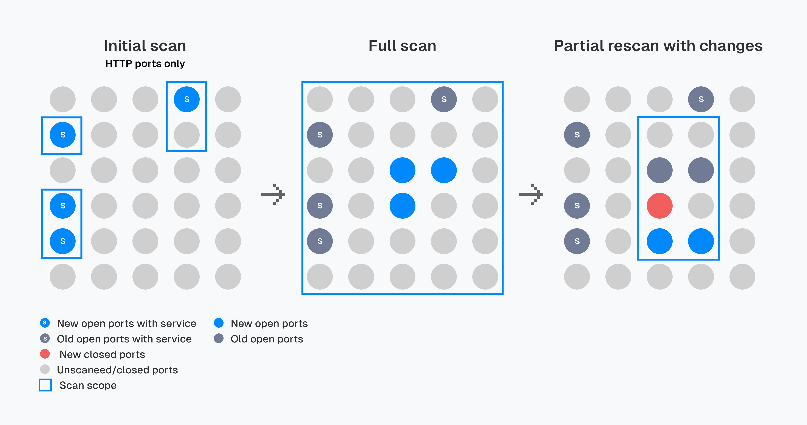

# What is Falcoria

**Falcoria** is a collaborative platform for managing port scanning data as a single structured dataset.  
It gives teams one place to track hosts, ports, and services, keeping results consistent and up to date across scans, while the distributed scanner speeds up data collection and updates.

---

## Why Falcoria

Falcoria addresses the common problems that appear in every large-scope assessment:

- targets change during the engagement (IPs, hostnames, subnets)
- ports open or close, services update banners or versions
- results are scattered across separate reports — top ports, HTTP-only, subsets of hosts — and need to be merged
- the same asset may be scanned multiple times under IP, CIDR, or hostname
- hard to track changes between scans and maintain history
- scans run slowly due to rate limits or bandwidth bottlenecks, so teams adjust accuracy for speed

Without a shared system, teams waste time, duplicate effort, and still miss hosts or ports.

### Key Features

✅ **Deduplication** — No unintentional duplicate scans. If two hostnames resolve to the same IP, it is scanned only once.

✅ **Single source of truth** — Each IP, hostname, and port exists as a unique entry in one dataset, available to the team.

✅ **Flexible updates** — Any entry can be updated or extended without affecting others. For example, you can start with HTTP ports, then add all remaining ports, or rescan the top-1000 — only selected entries change.

✅ **Change tracking** — New hosts, port state changes, and service banner updates are recorded in history.

✅ **Distributed scans** — Hosts are divided between workers, each scanning one host at a time. This reduces bandwidth bottlenecks, avoids rate limits, and results arrive host by host.

*Workflow illustration with service integration.*

## Who It's For

- Penetration testers working with changing scopes
- Red team operators running large-scale reconnaissance
- Security engineers maintaining an up-to-date view of exposed services

---

## Get Started

Want to see how Falcoria works in practice? Start here:  
[Common Workflow — Step-by-Step Example](use-cases/common-workflow.md)

- [Installation Guide](installation.md)  
- [Import Modes](import-modes/index.md)  
- [Architecture Overview](architecture.md)  

---
