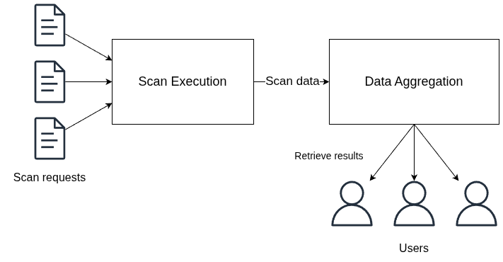

# What is Falcoria

Falcoria is a system for team-based network scanning for large and dynamic scopes.  
Each scan run updates a shared map of hosts, ports, and services used by the entire team.

---

Falcoria centralizes network scanning work and keeps scan results in one shared place.  
Each new scan updates existing data instead of creating isolated output files.

It addresses two practical problems:

- scan execution speed,
- consistency and sharing of scan results across the team.

This is handled by two main parts:

- **Scan execution** — runs scans and collects data  
- **Data aggregation** — merges scan results into a single shared view  

{ width="620" align=center }

---

## Scan Execution

Scan execution runs scans and produces scan data.
It is designed to be fast, reliable, and to avoid unnecessary network load.

---

### Scan Execution mechanisms

- **Distributed scanning**  
  Scan tasks can be executed across multiple workers.
  This allows scans to finish earlier by spreading work across different machines.  
  → [Learn more about distribution](concepts/distribution)

- **Target deduplication**  
  Duplicate targets are removed before scanning starts.  
  The same IP address, hostname, or subnet is not scanned more than once unintentionally.  
  This reduces unnecessary network load and lowers the risk of triggering rate limits.  
  → [Learn more about deduplication](concepts/deduplication)

- **Optimized scan configurations**  
  Predefined scan configurations are used to run scans with consistent and tested settings.  
  These configs provide a balance between speed and coverage.  
  → [Learn more about scan configs](concepts/configs)

→ [**Benchmarks**](benchmarks)

---

## Data Aggregation

Data aggregation is responsible for combining scan results into one shared view of the network.  
Each new scan updates the existing dataset rather than producing a separate report.

This ensures that the team always works with a single, up-to-date set of hosts, ports, and services,
even when scans are repeated, extended, or run by different people.

---

### Data Aggregation mechanisms

- **State-based data model**  
  All scan data is stored as a single set of unique records.
  Entries are updated automatically, so the entire team works with the same current view.

- **Incremental updates**  
  Scan results are applied incrementally to the shared dataset.
  New data extends or updates existing records without affecting unrelated entries.
  For example, scanning additional ports on known hosts adds only the new ports,
  while previously collected data remains unchanged.  
  → [Learn more about Import Modes](concepts/import-modes)

- **Focused change log**
  Tracks only actual changes in port state, service, or banner.
  Each entry shows the previous and new value for a single change.
  Full scan output and unchanged ports are excluded.  
  → [Learn more about Track History](concepts/track-history)

- **API and export access**  
  Aggregated scan data is available via an API and standardized export formats, including Nmap XML and JSON.  
  This allows teams to retrieve a unified network view and integrate it into existing tools, automation, and reporting pipelines.

- **CLI-based data exploration**  
  Scan data can be explored using a dedicated CLI, providing structured output and controlled navigation through large result sets.

## Who It's For

- Penetration testers working with large or frequently changing scopes
- Red team operators performing repeated network discovery
- Security engineers maintaining a current view of exposed hosts, ports, and services

---

## Get Started

To understand how Falcoria is used in practice, start here:  
[Common Workflow — Step-by-Step Example](workflow/typical-workflow)

- [Installation Guide](installation)  
- [Import Modes](concepts/import-modes)
- [Architecture Overview](architecture)  

---
