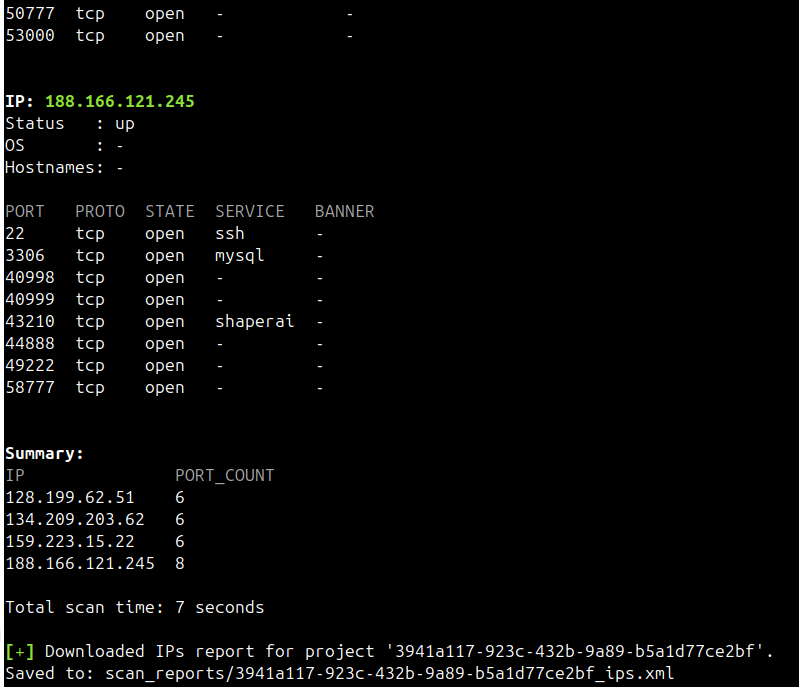

# What is Falcoria

**Falcoria** is a scanning and coordination platform built for penetration testers and red teams. It automates host discovery, port scanning, and result consolidation across multiple systems, enabling structured and repeatable reconnaissance workflows at scale.

---

## System Capabilities

### Parallelized Scan Execution

Falcoria distributes scan tasks across independent worker nodes. As more nodes are added, scan time is reduced. This enables parallel scanning over large scopes while maintaining control over execution logic.

### Reliable and Complete Scanning 

Falcoria does not sacrifice accuracy for speed. Instead, it maintains a balance between performance and completeness. Its default configuration prioritizes reliable results without missing open ports or introducing false positives.

### Controlled Deduplication

Falcoria applies deduplication at three levels:

1. **User Input** – Removes repeated targets from user-submitted input.  
   *Reduces noise and avoids unnecessary queue entries.*

2. **Scan Execution** – Skips targets already scanned or queued in the current project.  
   *Eliminates redundant scans and speeds up processing.*

3. **Data Import** – Uses [Import Modes](import-modes.md) to merge or replace results.  
   *Preserves valid data and prevents duplication in storage.*

This layered approach ensures targets are processed only once — unless explicitly redefined by the user.

### Stealth via Port Sharding

To reduce detection in monitored environments, Falcoria supports [port sharding](use-cases.md), distributing port ranges across workers. This minimizes scan signatures and allows phased recon under tighter controls.

### Configuration-Driven Workflow

Scanning behavior is defined through YAML configuration files. These files are reusable, version-controlled, and portable between environments or teams.

### API-Native Interface

All core actions — including project creation, scan execution, and result export — are accessible via documented HTTP APIs, enabling integration and automation.

---

## Why Falcoria

Traditional recon workflows rely on scattered tools and manual scripting, often leading to untracked scans and inconsistent results. Falcoria consolidates scanning, state tracking, and data import into a single interface. It ensures that data is unique, results are preserved, and effort is not duplicated.

---

## Typical Setup

Falcoria is designed to run across multiple Linux-based nodes. A minimal deployment includes:

- 1 server node running Redis, PostgreSQL, RabbitMQ, Scanledger, and Tasker
- 1 or more worker nodes executing scans and pushing results

Horizontal scaling is achieved by adding workers.

---

## Performance Snapshot

In the example below, 4 workers performed a full TCP scan across 4 IP addresses in approximately 7 seconds.

This output demonstrates Falcoria’s ability to scale horizontally and reduce total scan time through distributed execution.

