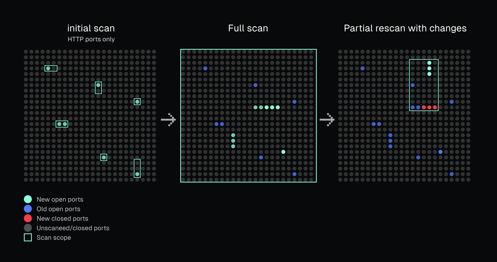
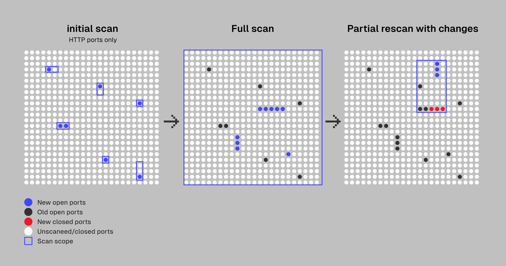
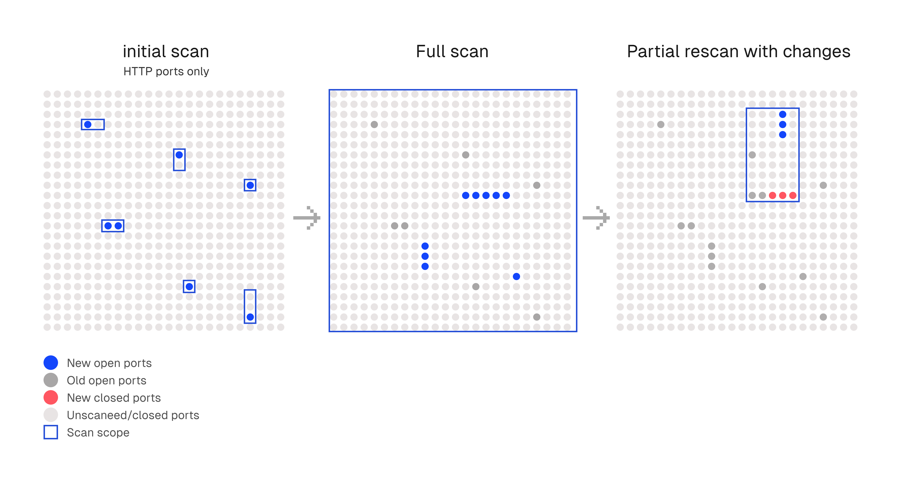
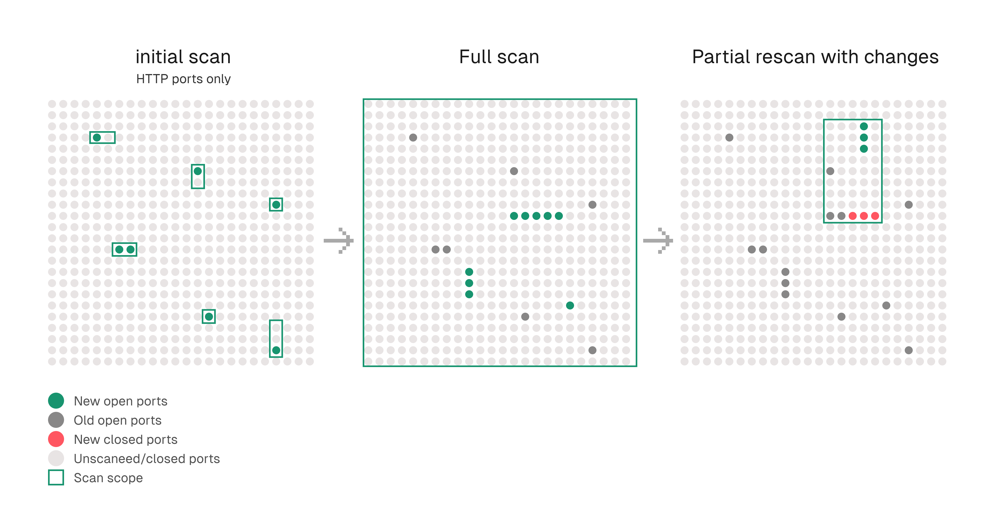
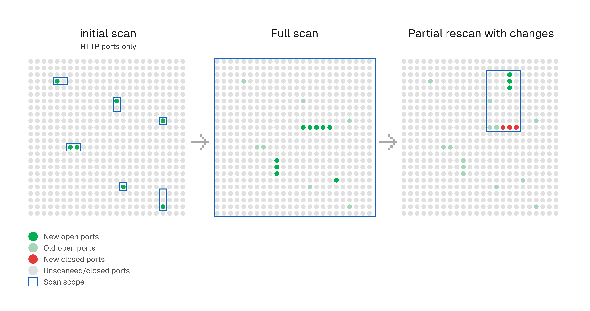

# What is Falcoria

**Falcoria** is a collaborative platform for storing and managing port scanning data, providing a single shared view of hosts, ports, and services for the entire team.
It maintains a structured dataset of discovered hosts, ports, and services, accessible to all team members.

---

## Why Falcoria

Falcoria addresses the common problems that appear in every large-scope assessment:

- scope targets (hostnames, IPs, CIDRs) change during the engagement
- ports open or close, services update banners or versions
- results are split across separate reports — top ports, HTTP-only, subsets of hosts — and need to be merged
- the same host may be scanned multiple times under IP, CIDR, or hostname
- difficult to track changes between scans and maintain history
- scan speed limitations — scanners hit bandwidth or rate limits, so teams adjust accuracy for speed

Without a shared system, gaps in handling these cases lead to wasted time and uncovered hosts or ports.

### Key Features

✅ **Deduplication** — IPs, hostnames, and ports are not scanned unintentionally more than once. If two hostnames resolve to the same IP, it is scanned only once.

✅ **Single source of truth** — Each IP, hostname, and port exists as a unique entry in one dataset, available to the team.

✅ **Flexible updates** — Any entry can be updated or extended without affecting others. For example, you can start with HTTP ports, then add all remaining ports, or rescan the top-1000 — only selected entries change.

✅ **Change tracking** — New hosts, port state changes, and service banner updates are recorded in history.

✅ **Distributed scans** — During the scanning phase, hosts are divided between workers, and each worker scans one host at a time. This reduces bandwidth bottlenecks, avoids rate limits, and results arrive host by host.

---

*Falcoria scanning phases: visual summary of the process from target discovery to distributed scan completion.*

*Initial targets identified for scanning.*

*First light scan performed on selected targets.*

*Second light scan expands coverage or refines results.*

*Full scan phase for comprehensive results and enrichment.*

*Example of Falcoria integrating AI for scan enrichment or analysis.*

## Who It's For

- Penetration testers working with changing scopes
- Red team operators running large-scale reconnaissance
- Security engineers maintaining an up-to-date view of exposed services

---

## Get Started

Want to see how Falcoria works in practice? Start here:  
[Common Workflow — Step-by-Step Example](use-cases/common-workflow.md)

- [Installation Guide](installation.md)  
- [Import Modes](import-modes/index.md)  
- [Architecture Overview](architecture.md)  

---
