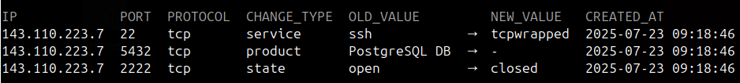

# Workflows

Practical patterns for using Falcoria across common engagement scenarios.

## Expanding scan coverage

Start narrow, then expand. Each phase adds to the existing data without overwriting previous results.

**Phase 1** — HTTP ports only, insert mode (default — adds new hosts, skips known ones):

```bash
falcli scan start --config http-only.yaml --targets-file hosts.txt
```

**Phase 2** — Full port range, append mode (adds new ports, keeps existing results):

```bash
falcli scan start --config full-range.yaml --mode append --targets-file hosts.txt
```

**Phase 3** — Service detection, update mode (refreshes service info on known ports):

```bash
falcli scan start --config service-detect.yaml --mode update --targets-file hosts.txt
```

Each phase uses a different [import mode](concepts/import-modes.md) matching its intent. At every point, `falcli project ips get` returns the full state across all phases and all team members.

## Scope changes

When the client adds targets or recon finds new hosts, add them to the same target file and re-run:

```bash
falcli scan start --config http-only.yaml --targets-file hosts.txt
```

Falcoria detects which targets are already scanned and sends only the new ones.

## Resuming interrupted scans

Scans can be stopped at any point:

```bash
falcli project scan stop
```

This clears the queue and stops sending new tasks to workers. Results from targets that were already scanned are kept in [ScanLedger](architecture.md).

To resume, re-run the same command:

```bash
falcli scan start --config full-range.yaml --targets-file hosts.txt
```

Falcoria checks what's already been scanned and queues only the remaining targets.

## Importing external reports

To consolidate results from tools outside Falcoria (Nmap, Masscan, etc.):

```bash
falcli project ips import -f nmap_output.xml --mode append
```

Choose the import mode based on the report's completeness:

- **Insert** — adding new hosts with their ports, already known hosts are skipped
- **Append** — adding partial scan results safely
- **Update** — refreshing service info from a follow-up scan
- **Replace** — applying a complete, authoritative scan

## Distributed scanning

Deploy multiple workers on separate machines. Each worker connects to the same Tasker instance and picks up tasks from the shared queue.

All workers send results to the same ScanLedger. No coordination is needed between workers — the queue handles task assignment, ScanLedger handles merging.

To add capacity, deploy additional workers. Throughput scales linearly with worker count until network or target-side limits are reached.

## Port sharding

To stay under per-source rate limits while covering a large port range, submit multiple scan tasks with different port ranges:

```bash
falcli scan start --config ports-1-10000.yaml --targets-file hosts.txt
falcli scan start --config ports-10001-20000.yaml --targets-file hosts.txt
falcli scan start --config ports-20001-65535.yaml --targets-file hosts.txt
```

Different workers pick up different tasks and scan from different IPs. Each source stays under the limit; combined, they cover the full range.

## Team coordination

Multiple team members work against the same Falcoria instance. Each can submit targets, launch scans with different configs, view the current shared state, and check what changed between scans.

Duplicates are handled automatically. No manual scope splitting or result collection needed.

## Tracking changes

After rescanning, view what [changed](concepts/change-history.md):

```bash
falcli project ips history
```



History shows state transitions: port opened, port closed, service changed, banner updated. On a large scope, this is the fastest way to find what moved between scan cycles.

## Exporting results

Export the current shared state at any point:

```bash
falcli project ips download
```

The export reflects the current state across all scans, in Nmap XML format. Use this to feed results into other tools or for reporting.
